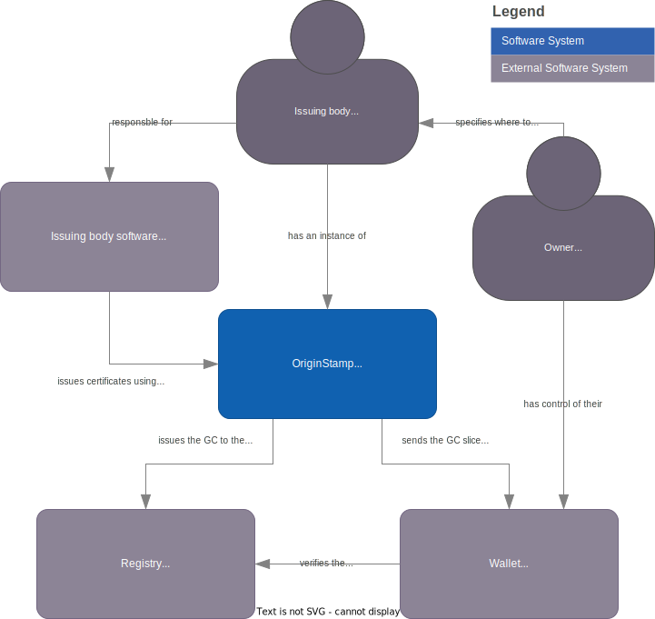

# Project Origin - OriginStamp

OpenSource project to create a issuer service to simplify issuing certificates on the Project Origin platform.

The name `OriginStamp` is a play on words,
where `Origin` links to the project's name, while `Stamp` evokes the idea of officially marking or certifying something,
emphasizing the service's role in issuing certificates.

## tl:dr

In the Project-Origin Electricity implementation a Granular Certificate consists of a fungible and non-fungible digital assets.
The non-fungible part are the information on the GC, all the attributes on it. 
The fungible assets are called GC slices and contain the owner information and the amount in the slice.

The GCs are issued by an issuer and are stored in a registry. And an owner keeps track of their ownership of GC slices in a wallet.
The process of issuing a GC is a complex process that involves multiple systems, to simplify this process, the OriginStamp is created.

It will enable an issuer to issue GCs using a simple REST API, and OriginStamp will take care of the complexity of the process.

## Problem

Each entity that issues GCs has to implement a system that can handle the issuing process.

This is a complex process that involves multiple systems.
First issuing the GC to the registry, and awaiting the registry to finalize the transaction.
Then the issuing service has to send the GC to the owner's wallet.

Part of this process is also to handle the owners walletEndpoint and hierarchical deterministic keys as to ensure not to reuse addresses.
As this can leak information about the owner's wallet.

Also data within the GCs are using Pedersen commitments and hashed data to ensure privacy and integrity,
and OriginStamp has to handle this complexity.

The Issuer-service should also store a record of the issued GCs and secret data,
so as to be able to provide a proof of issuance.

## Context

Issuing bodies want an easy way to issue GCs, and not have to implement a complex system to do so.

## Forces

OriginStamp should be able to be self hosted in an issuers on infrastructure,
or hosted by a third party.

OriginStamp should be able to handle the complexity of the issuing process.

OriginStamp should ease the process of issuing GCs for a new issuer.

## Solution

OriginStamp will enable an issuer to issue GCs using a simple REST API,
and OriginStamp will take care of the complexity of the process.

The REST api will include endpoints for, but not limited to, the following features:

- Issuing a GC.
- List of issued GCs.
- Status for the issuance.

[Example API for issuing GCs](./doc/example-api.md)

## Sketch

Below is a C4 system diagram of an overview of the system landscape OriginStamp is a part of.

## Resulting Context

OriginStamp will enable an issuer to easily issue GCs while not requiring the issuer to implement a complex system
and understanding all the complexity of the requirements for issuing GCs.

OriginStamp also ensures that best practices are followed when issuing GCs, and that the privacy and integrity of the GCs are maintained.
