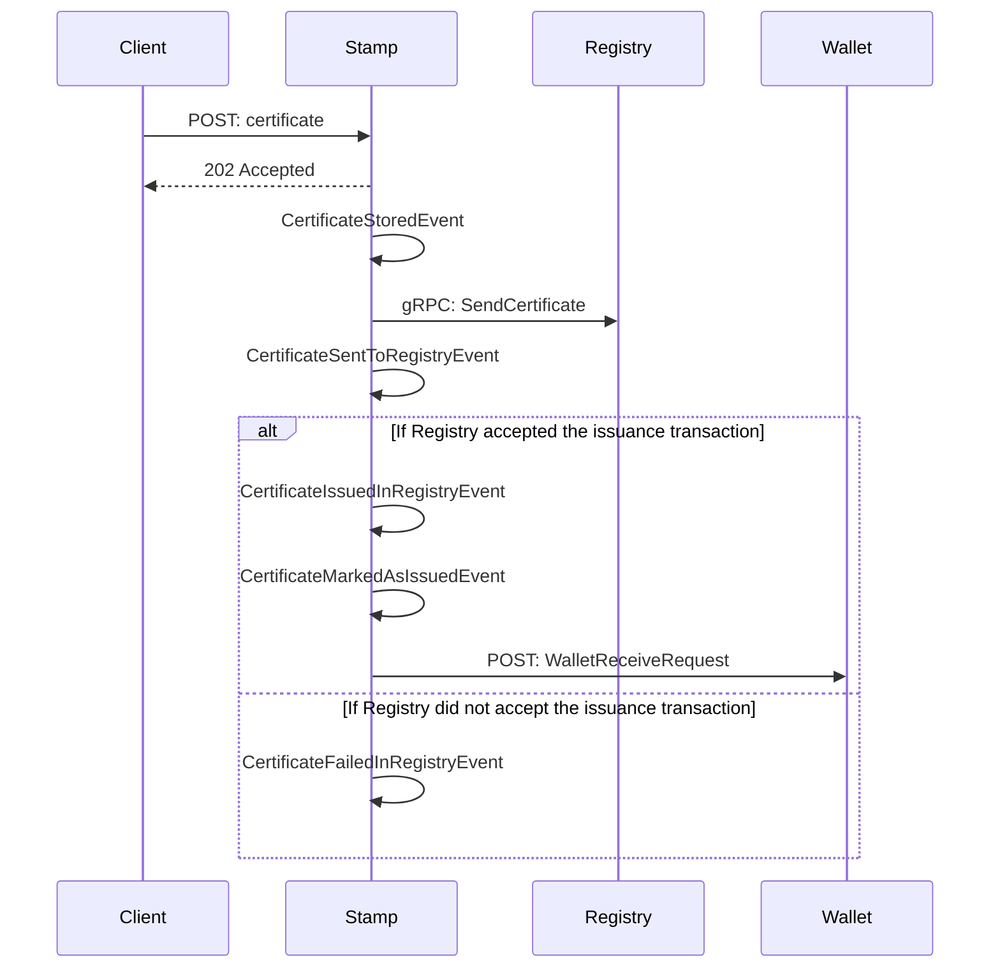

# Issuance flow

The sequence diagram below shows the flow of messages between the components when issuing a single certificate. All messages are published to the message broker; the message broker is not shown in the diagram. Before that flow is possible, a recipient must be created in Stamp.

Stamp receives a certificate through an api endpoint. After receiving the certificate, the issuance flow starts with publishing an event. This starts a series of event handlers which is executed in sequence after eachother as modeled below:

The Registry only allows issuing of certificates from the issuing body and in this case that is Energinet. Hence, a Wallet System is not able to issue certificates. So Stamp is responsible for issuing first to the registry and then sending to the wallet. For this to happen, the owner public key on the certificate must be created or calculated by Stamp; the next section describes how the Certificates domain calculates the key.

### Key position when sending certificates/slices to the wallet

A wallet endpoint is needed in order to send slices to the wallet. A position for deriving the child key is needed for each slice sent to the wallet. The position is a integer in the Wallet API. It is a requirement that a new position is used for each new slice.

We calculate endpoint positions by keeping track of recipients current position in the database. If we get a new certificate, the position is increased by 1.
