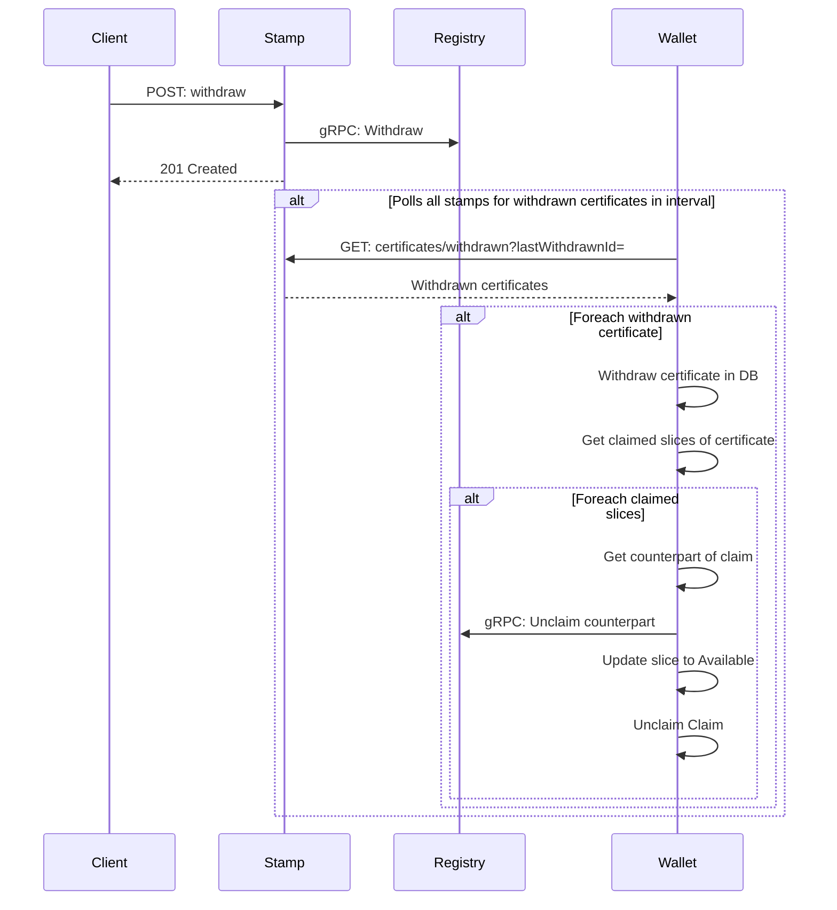

# Withdraw flow

The sequence diagram below describes the flow of withdrawing a issued certificate. It works by having Stamp keeping track of all withdrawn certificates. The Vault polls all Stamps for a configured interval and withdraws the certificates in the Vault database. If the certificate, or a part of the certificate, was claimed then the counterpart of the claim is unclaimed.

This above means Vault needs to know all known Issuers (Stamps) in the network.
